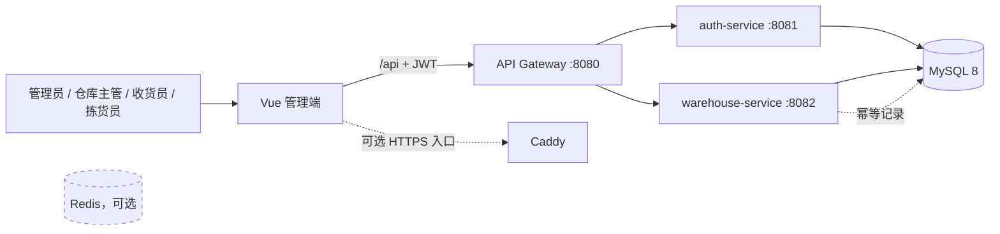

# 系统架构

## 1. 架构目标

Firefly Logistics 面向中小型仓库的基础资料、入库、库存和出库管理。系统使用轻量 Spring Cloud 服务边界和统一网关，不强制引入注册中心或 Redis，使本地开发、单机 Compose 和 Railway 私有网络部署保持一致。

当前设计原则：

- 浏览器只访问前端，业务 API 统一经过 API Gateway。
- 认证服务管理身份，网关验证令牌并按岗位授权，前端权限只负责交互呈现。
- 库存余额、库存流水和单据状态在同一数据库事务内提交。
- 数据库负责分页、唯一性和关键数量约束，应用层负责业务状态和错误语义。
- 写请求可携带幂等键安全重试；库存操作按稳定顺序加锁，降低丢失更新和死锁风险。
- 数据结构由 Flyway 顺序迁移，生产环境不使用 Hibernate 自动改表。

## 2. 技术与组件

| 层次 | 技术 |
| --- | --- |
| Web 前端 | Vue 3、TypeScript、Vite、Vue Router、Pinia、Element Plus、Axios |
| API 网关 | Spring Cloud Gateway、响应式全局 JWT/RBAC 过滤器 |
| 后端服务 | Java 17、Spring Boot 3.5.6、Spring Cloud 2025.0.3 |
| 身份安全 | Spring Security、BCrypt、JWT HS256 |
| 数据访问 | Spring Data JPA、Hibernate、数据库分页 |
| 数据迁移 | Flyway，认证与仓储使用独立历史表 |
| 数据库 | MySQL 8；测试使用 H2 和可选 MySQL Testcontainers |
| 交付 | Docker Compose、Caddy、Railway、GitHub Actions |



| 模块 | 端口 | 职责 |
| --- | ---: | --- |
| `common` | - | 统一响应、令牌声明与 JWT 签发/解析 |
| `gateway` | 8080 | 路由、CORS、清理伪造身份头、JWT 校验、岗位授权和身份透传 |
| `auth-service` | 8081 | 登录保护、当前用户、用户新增/编辑/启停、角色目录 |
| `warehouse-service` | 8082 | 本地 JWT/RBAC 防线；仓储业务、多快递账号、聚合订单和同步日志 |
| `frontend` | 80/5173 | 管理端、路由守卫、岗位菜单和分页交互 |

## 3. 身份认证

登录成功后，认证服务签发带有以下关键声明的 JWT：

- `sub`：用户名；
- `uid`：用户 ID；
- `role`：当前单一岗位角色；
- `iss` / `aud`：由 `JWT_ISSUER` 和 `JWT_AUDIENCE` 配置；
- `iat` / `exp`：签发和过期时间；
- `jti`：每个令牌随机生成的唯一标识。

认证服务和网关必须使用完全相同的 `JWT_SECRET`、`JWT_ISSUER` 和 `JWT_AUDIENCE`。网关先验证签名、签发方、受众、有效期和非空 `jti`，随后向认证服务核对撤销记录、账号状态和最新角色；认证服务不可用时采用失败关闭并返回 `401`。主动退出、停用或改岗会在网关下一次请求即时生效。

登录保护由用户行悲观锁保证计数一致性。默认连续失败 5 次后锁定 15 分钟，可通过 `LOGIN_MAX_FAILURES` 和 `LOGIN_LOCK_MINUTES` 调整。成功登录、管理员重置密码或重新启用账号会清零失败状态。对于不存在的用户名也执行 BCrypt 虚拟校验，避免明显的账号枚举时序差异。

用户管理接口还会按令牌中的用户 ID 重新读取数据库，确认操作者仍启用、未锁定且当前仍为管理员，避免停用或降级前签发的旧管理员令牌自我恢复。影响管理员集合的写操作先悲观锁定固定 `ADMIN_SET` guard，再锁操作者和目标用户，因此并发停用/降级也不能把启用管理员数量降为零。

## 4. RBAC 与信任边界

当前是“每个用户一个岗位角色”的真实 RBAC，而非前端静态演示。角色由认证服务保存、管理并写入 JWT。

| 能力 | `ADMIN` | `WAREHOUSE_MANAGER` | `RECEIVER` | `PICKER` |
| --- | :---: | :---: | :---: | :---: |
| 用户和角色管理 | ✓ |  |  |  |
| 登录后只读查询 | ✓ | ✓ | ✓ | ✓ |
| 快递账号配置与同步日志 | ✓ | ✓ |  |  |
| 聚合快递订单查询 | ✓ | ✓ | ✓ | ✓ |
| 基础资料写入 | ✓ | ✓ |  |  |
| 库存调整、移库 | ✓ | ✓ |  |  |
| 入库创建、收货 | ✓ | ✓ | ✓ |  |
| 出库创建、分配、发运 | ✓ | ✓ |  | ✓ |

请求链如下：

1. 网关先删除客户端提供的 `X-User-Id`、`X-Username` 和 `X-User-Role`。
2. 除登录、健康检查和 CORS 预检外，请求必须携带 Bearer JWT。
3. 网关验证 JWT、令牌实时状态和路径/HTTP 方法权限。
4. 验证成功后，网关重新写入受信任的用户头并转发。
5. 认证服务自身还使用 Spring Security 保护 `/api/auth/users/**` 与 `/api/auth/roles`。
6. 仓储服务再次解析同一 Bearer JWT、执行同一角色矩阵，并使用令牌声明覆盖 `X-User-*`，因此即使直连也不能靠伪造身份头绕过鉴权。

网关和仓储服务构成纵深防御。仓储服务仍应只位于私有网络中，以减少攻击面；但其 8082 端口被误暴露时也会要求有效 JWT。三个服务必须配置相同的 `JWT_SECRET`、`JWT_ISSUER` 和 `JWT_AUDIENCE`。`WAREHOUSE_SECURITY_ENABLED=false` 仅供受控测试使用，任何共享或生产环境都不得关闭仓储本地安全防线。

## 5. 数据访问与分页

仓库、货位、商品、往来单位、单据、库存、流水、快递账号、聚合订单、同步日志和用户列表都通过 Spring Data `Page` 在数据库侧筛选与分页，返回统一的 `records/total/page/size`。页码从 1 开始；用户列表每页最多 100，仓储列表最多 200。关联名称采用批量查询映射，避免逐行 N+1 查询。

V3 迁移增加状态/创建时间、FEFO、库存流水和幂等记录索引。分页查询仍需结合实际生产数据量使用 `EXPLAIN` 验证，并根据查询分布调整组合索引。

## 6. 库存事务、锁与幂等

库存变化遵循：

```text
验证业务状态和主数据 → 按稳定顺序锁定单据/货位/余额
→ 校验可用量 → 更新余额 → 追加库存流水 → 推进单据状态 → 提交
```

- 入库收货、库存调整和移库按“仓库＋货位＋SKU＋批次”锁定库存维度；创建新余额时通过货位行锁与维度唯一约束串行化。
- 出库分配按 FEFO 顺序锁定候选余额，过滤已过期批次和停用货位；发运再次锁定分配涉及的余额。
- 单据的收货、分配和发运使用悲观锁与状态机避免重复过账。
- `wms_inventory_balance.version` 保留乐观锁兜底；V3 的 CHECK 和外键约束阻止负库存及悬空流水。

创建入库/出库、收货、调整、移库、分配和发运支持 `Idempotency-Key`。幂等范围是“操作类型＋键”，请求内容用 SHA-256 摘要比对，完成响应保存在 MySQL：

- 同键、同请求：重放首次业务结果，不重复记账；
- 同键、不同请求：返回 `409`；
- 并发相同请求：数据库唯一约束决定唯一执行者，其他请求读取已完成结果；
- 不传键：按普通请求执行，因此第三方调用方必须自行确保创建类操作不会被重复提交。

幂等记录的归档/清理策略尚未自动化，长期运行前应按业务最长重试窗口设计保留周期。

## 7. 数据与迁移边界

认证服务拥有 `sys_user`、`sys_security_guard` 和 `flyway_auth_schema_history`；仓储服务拥有 `wms_*` 表和 `flyway_warehouse_schema_history`。当前两个服务共用一个 MySQL 数据库，但不跨服务直接修改对方表。两套 Flyway 均以版本 0 允许在已被另一服务建表的 schema 中初始化自己的历史表，V1 业务迁移仍会正常执行。若未来独立数据库，可使用 Outbox 与消息队列同步用户审计或库存事件，避免分布式事务。

仓储迁移版本与 Profile：

- `V1__create_warehouse_schema.sql`：核心仓储结构；
- `V3__harden_inventory_and_idempotency.sql`：幂等记录、查询索引、流水外键和数据 CHECK 约束。
- `V4__add_carrier_integration.sql`：快递账号、聚合订单与同步日志；凭证只保存 AES-GCM 密文。
- `V5__add_carrier_sync_resilience.sql`：定时配置、原子租约、连续失败、熔断和下次执行时间。
- `db/demo/V2__seed_demo_master_data.sql`：仅在 `demo` Profile 下加入 Flyway locations；默认与 `prod` 不播种演示数据。

完整 Compose 会为仓储服务启用 `demo` Profile，本机原生或云端 `prod` 默认只扫描 `db/migration`。已执行的迁移不可修改：如果旧数据库已经在 `flyway_warehouse_schema_history` 登记了原默认位置的 V2，升级时会出现 missing/checksum 风险。不要执行 `repair` 掩盖差异；应保留匹配旧历史的构件继续维护该库，或在完成数据备份/迁移后用新库重建。生产库不得启用 `demo`。

## 8. 部署与持续集成

`docker-compose.yml` 默认构建并启动 MySQL、auth-service、warehouse-service、gateway 和 frontend，前端 Caddy 将 `/api` 转发到网关；Redis 置于可选 `redis` Profile。健康检查决定依赖启动顺序。

本机没有 Docker 时，使用 [Railway 部署指南](../deploy/railway/README.md)。Railway 只为前端生成公网域名，其余服务通过私有域名通信；warehouse-service 与 gateway/auth-service 一样必须注入相同 JWT 三项配置。CI 位于 `../.github/workflows/ci.yml`，执行 Maven 验证和前端 Lint、Vitest、生产构建。

## 9. 生产基线与路线图

生产基线包括 HTTPS、私有服务网络、唯一 JWT 密钥、强管理员密码、关闭不需要的管理员引导、数据库最小权限与备份、日志脱敏、资源限制和告警。`prod` Profile 会拒绝已知开发 JWT 密钥及默认管理员密码。

多快递接入第二阶段使用数据库原子更新领取限时租约，无需额外 Redis 即可防止多实例重复同步；执行失败最多重试 3 次，连续失败达到阈值后持久化熔断截止时间。异步应用事件仅输出脱敏运行指标。第三阶段在现有订单上提供无额外存储的新疆演示计价、派生轨迹和周期聚合对账，保持实现可替换；官方沙箱适配器须在取得各快递公司授权和独立凭证后接入。
