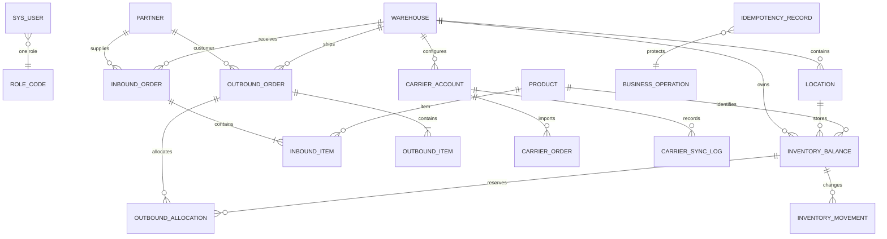

# 数据模型

## 1. 建模约定

- 主键使用 MySQL 自增 `BIGINT`；面向用户和外部系统使用唯一业务编码或单号。
- 表和字段使用 `snake_case`，Java 实体使用 `camelCase`。
- 当前数量使用 `BIGINT` 表示整件；重量、长度等小数计量应通过后续迁移改为定点 `DECIMAL`，不能使用浮点数。
- 仓储业务表带有创建/更新时间；库存流水只追加，已生效单据通过状态流转而非物理删除。
- Hibernate 使用 `ddl-auto=validate`，结构变更只能通过 Flyway 追加迁移。
- 列表筛选、排序和分页在数据库完成，页码由 API 转换为 1-based 结果。

## 2. 核心关系



`ROLE_CODE` 与 `BUSINESS_OPERATION` 是概念节点，不是当前数据库表。

## 3. 认证领域

### `sys_user`

| 字段 | 含义 |
| --- | --- |
| `id` | 用户 ID |
| `username` | 唯一登录名 |
| `password_hash` | BCrypt 密码哈希 |
| `display_name` | 显示名称 |
| `role` | 单一角色：`ADMIN`、`WAREHOUSE_MANAGER`、`RECEIVER` 或 `PICKER` |
| `enabled` | 是否允许登录 |
| `registration_pending` | 是否为待管理员审批的公开账号申请 |
| `failed_login_attempts` | 连续失败次数 |
| `locked_until` | 锁定截止时间，为空表示未锁定 |
| `created_at` | 创建时间 |

管理员 API 支持创建、分页查询和更新用户；停用、角色变更和密码重置直接作用于本表。成功登录、管理员重置密码或启用用户会清理失败次数和锁定时间。当前每个用户只允许一个角色；一人多岗和权限点模型仍需后续引入 `sys_role`、`sys_permission` 及关联表。

### `sys_security_guard`

固定记录 `ADMIN_SET` 是管理员集合变更的事务锁。所有可能新增、停用或降级管理员的写操作先对该行加悲观锁，再复核操作者和目标用户，从而串行化“至少一名启用管理员”的不变量检查。

JWT 本体不在数据库持久化。`sys_revoked_token` 保存主动退出令牌的 `jti` 和过期时间；网关通过认证服务同时检查撤销、账号启用/锁定状态和最新角色，过期撤销记录在后续登录或退出时清理。`sys_auth_audit` 记录登录、退出、注册申请和管理员账号变更。

## 4. 基础资料领域

| 表 | 核心信息与约束 |
| --- | --- |
| `wms_warehouse` | 唯一仓库编码、名称、地址、负责人、`ACTIVE/INACTIVE` 状态 |
| `wms_location` | 仓库、仓内唯一货位编码、名称、类型、非负容量、状态 |
| `wms_product` | 唯一 SKU、名称、品类、单位、条码、非负安全库存、状态 |
| `wms_partner` | 唯一编码、名称、`SUPPLIER/CUSTOMER` 类型、联系人、电话、状态 |

新建单据和库存作业会验证相关主数据仍为启用状态。历史单据引用的基础资料不能通过物理删除来“纠错”。

## 5. 单据领域

### 入库

- `wms_inbound_order`：唯一入库单号、仓库、供应商、`PENDING/PARTIALLY_RECEIVED/RECEIVED` 状态、预计到货、总量、实收量、备注和审计时间。
- `wms_inbound_item`：入库单、SKU、计划/实收数量、批次和有效期。

确认收货时悲观锁定订单，更新表头/明细实收量，并在同一事务内更新余额和追加流水。

### 出库

- `wms_outbound_order`：唯一出库单号、仓库、客户、`PENDING/ALLOCATED/PICKED/PACKED/SHIPPED/CANCELLED/RETURNED` 状态、要求发运时间、总量/分配量/发运量和备注。
- `wms_outbound_item`：SKU、计划量、已分配量、已发运量和可选指定批次。
- `wms_outbound_allocation`：订单、明细、库存余额及分配数量，记录预占来自哪个库存维度。

分配时按 FEFO 锁定可用余额；发运时按稳定顺序重新锁定所有分配余额，并同时扣减实物量和预占量。

## 6. 库存余额与流水

### `wms_inventory_balance`

当前库存唯一维度为：

```text
warehouse_id + location_id + product_id + batch_no
```

空批次规范化为空字符串，使唯一约束可以稳定工作。`expiry_date` 与该批次维度绑定；相同维度不能保存不同有效期。

| 字段 | 含义 |
| --- | --- |
| `quantity` | 实物库存总量 |
| `allocated_quantity` | 已分配、尚未发运的数量 |
| `locked_quantity` | 业务锁定数量 |
| `available_quantity` | API 计算值：实物量－分配量－锁定量 |
| `expiry_date` | 有效期，FEFO 和过期排除依据 |
| `version` | JPA 乐观锁版本 |

数据库 V3 CHECK 与应用层共同保证：

```text
quantity >= 0
allocated_quantity >= 0
locked_quantity >= 0
allocated_quantity + locked_quantity <= quantity
```

### `wms_inventory_movement`

流水记录流水号、类型、仓库、货位、SKU、批次、带方向数量、引用类型/ID、原因、操作人和时间。入库、退货和移入为正数，出库和移出为负数；盘点只写差异量，移库写入 `TRANSFER_OUT` 和 `TRANSFER_IN` 两条流水。

`GET /api/inventory/movements` 直接分页读取该账本。系统不提供更新或删除流水的 API；未来退货、取消和红冲必须追加反向业务流水。

## 7. 幂等记录

### `wms_idempotency_record`

| 字段 | 含义 |
| --- | --- |
| `operation` | 业务操作类型，例如 `RECEIVE_INBOUND` |
| `idempotency_key` | 客户端提供的键，最长 128 字符 |
| `request_hash` | 操作和请求 JSON 的 SHA-256 摘要 |
| `status` | `PROCESSING` 或 `COMPLETED` |
| `response_body` | 首次成功业务结果 JSON |
| 审计时间 | 创建与更新时间 |

`(operation, idempotency_key)` 是唯一约束。同键同请求读取首次结果，同键不同请求返回 `409`；并发插入由唯一约束选出唯一执行者。幂等记录与业务动作使用同一事务，因此业务回滚不会留下伪完成结果。

当前未实现自动清理。生产运行前应根据最长客户端重试窗口确定保留期、归档与清理任务；清理前必须确认历史请求不会再被重放。

## 8. 多快递集成

| 表 | 作用与关键约束 |
| --- | --- |
| `wms_carrier_account` | 仓库下的快递账号；凭证使用 AES-GCM 加密；保存自动同步间隔、下次执行、租约、连续失败与熔断截止时间 |
| `wms_carrier_order` | 外部订单快照；`account_id + external_order_no` 唯一，重复同步执行更新而非重复插入 |
| `wms_carrier_sync_log` | 每次手动/定时同步的触发方式、结果、数量、消息和耗时 |

第二阶段的 `mock://` 适配器每天为每个账号生成 3 张仅含新疆区域且不含姓名、电话和地址的确定性订单。调度实例先用条件更新领取账号租约；成功后设置下次执行时间并清零失败，最终失败则累计次数并可能打开熔断。生产必须单独配置唯一 `CARRIER_CREDENTIAL_KEY`；响应、同步日志和异步事件均不得输出凭证明文或密文。

## 9. 并发控制

| 资源 | 保护方式 |
| --- | --- |
| 登录用户行 | `SELECT ... FOR UPDATE`，串行更新失败计数 |
| 入库/出库单 | 悲观写锁＋状态校验 |
| 已存在库存余额 | 按库存维度或 ID 悲观写锁；`version` 作为兜底 |
| 新库存维度 | 先按稳定顺序锁货位，再依赖维度唯一约束 |
| FEFO 分配 | 过滤过期/停用货位后按有效期和 ID 排序加锁 |
| 移库 | 按 ID 锁源/目标货位和余额，避免反向顺序死锁 |
| 相同幂等命令 | 幂等唯一约束和请求摘要 |

一次库存事务必须原子完成“余额更新＋流水追加＋单据/分配状态更新”。应用捕获重复键并转换为稳定冲突结果；数据库仍是最终一致性防线。

## 10. 分页与索引

以下列表使用 Spring Data `Page` 和数据库查询，而不是先 `findAll()` 再在内存截取：用户、仓库、货位、商品、合作方、入库单、库存余额、库存流水和出库单。用户页大小上限为 100，仓储页上限为 200，并使用批量 `findAllById`/明细 fetch 查询补齐关联显示字段。

V3 新增或强化的索引包括：

- 货位 `(warehouse_id, status)`；
- 商品 `status`、合作方 `(type, status)`；
- 入库/出库 `(status, created_at)`；
- 库存 `(warehouse_id, product_id, expiry_date, batch_no)`；
- 流水 `(warehouse_id, type, created_at)`；
- 幂等记录创建时间。

生产数据增长后仍需用慢查询和 `EXPLAIN` 验证；关键字包含查询可能需要全文检索或专用搜索服务。

## 11. Flyway 迁移与 Demo 数据

认证服务使用 `flyway_auth_schema_history`：

- `db/migration/V1__create_auth_schema.sql`：用户表；
- `db/migration/V2__add_login_protection.sql`：失败次数和锁定时间；
- `db/migration/V3__add_security_guard.sql`：管理员集合并发保护锁。
- `db/migration/V4__add_registration_approval.sql`：账号申请审批标志；
- `db/migration/V5__add_token_revocation_and_auth_audit.sql`：令牌撤销与认证审计。

仓储和认证共用一个 schema，但各自维护历史表。后启动的服务会先写入 Flyway V0 基线标记，再执行自己的 V1；V0 只解决“schema 已被另一服务占用”的历史表初始化，不代表业务结构版本，也不会跳过 V1。

仓储服务使用 `flyway_warehouse_schema_history`：

- 默认 location `classpath:db/migration`：`V1` 核心结构、`V3` 幂等/约束强化、`V4` 多快递集成和 `V5` 同步韧性；
- `demo` Profile 额外加入 `classpath:db/demo`，其中 `V2__seed_demo_master_data.sql` 插入演示仓库、货位、商品、合作方和库存；
- `demo/R__seed_public_orders.sql` 以可重复、幂等方式加入 8 张 UCI Online Retail II 真实匿名交易、40 条商品明细和国内快递服务商资料。订单来源为 [UCI Online Retail II](https://archive.ics.uci.edu/dataset/502/online%2Bretail)（DOI `10.24432/C5CG6D`，CC BY 4.0）；仅平移演示时间和分配 WMS 状态，原始发票号、时间、国家和金额保留在备注中；
- `application-demo.yml` 负责组合这两个 locations；完整 Docker Compose 明确启用 `demo`，默认/`prod` 不会播种演示数据。

国内物流服务供应商的全国客服热线来自各公司官网：中通 `95311`、圆通 `95554`、韵达 `95546`、申通 `95543`、顺丰 `95338`。它们复用当前合作方 `SUPPLIER` 类型，不包含个人网点或面单信息。

版本号不要求文件在同一目录连续；全新 Demo 模块会在可选 V0 基线之后按 `V1 → V2 → V3 → V4 → V5` 执行。生产必须只扫描默认迁移目录。Demo Profile 应在空库首次迁移前确定：若数据库已经执行到更高版本后才启用 demo，低版本 V2 默认不会补跑。

### 旧数据库兼容警告

早期构件曾把 V2 放在默认 `db/migration`。若旧数据库的历史表已经记录该 V2，而新 `prod` 构件只扫描 V1/V3，Flyway 可能报告 applied migration missing locally；如果文件内容也发生过变化，还可能报告 checksum mismatch。

处理原则：

1. 先备份数据库和 `flyway_warehouse_schema_history`。
2. 不要直接删除历史行、改 checksum 或执行 `flyway repair` 掩盖差异。
3. 仍需原库原地维护时，使用包含原 V2 且校验和匹配的旧构件，并规划显式兼容迁移。
4. 可以迁移重建时，导出所需业务数据，在新库上用当前 Profile 完成全新迁移后再受控导入。

新建生产库不启用 `demo`，因此不存在这类历史兼容问题。

## 12. 后续模型路线图

仍需新增的模型包括质检/上架任务、部分发运/退货、范围盘点与冻结、多货主、序列号、单位换算、库容温区、PDA 扫描记录、仓库数据范围、权限点和 Outbox 事件。当前盘点复用库存余额和流水，适合单维度即时盘点。
